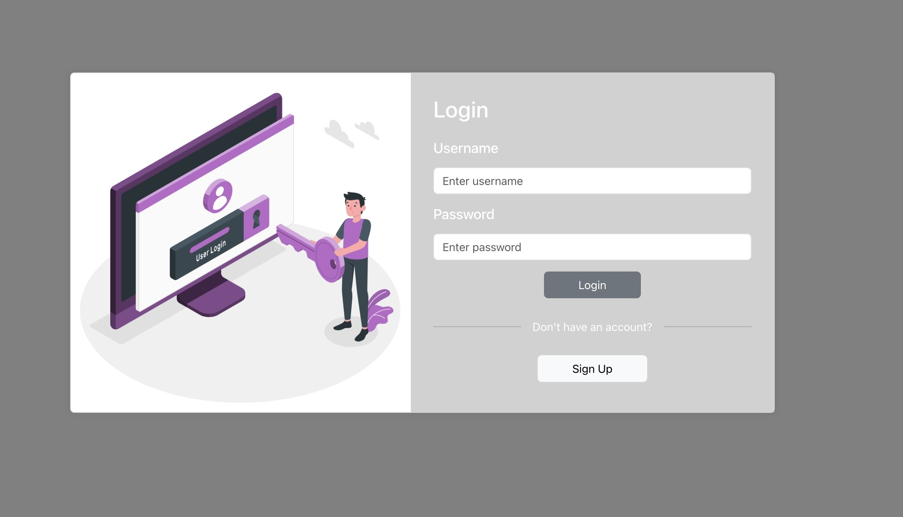
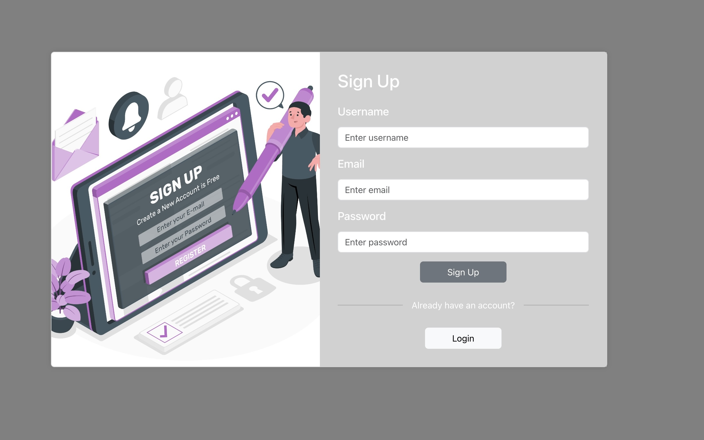
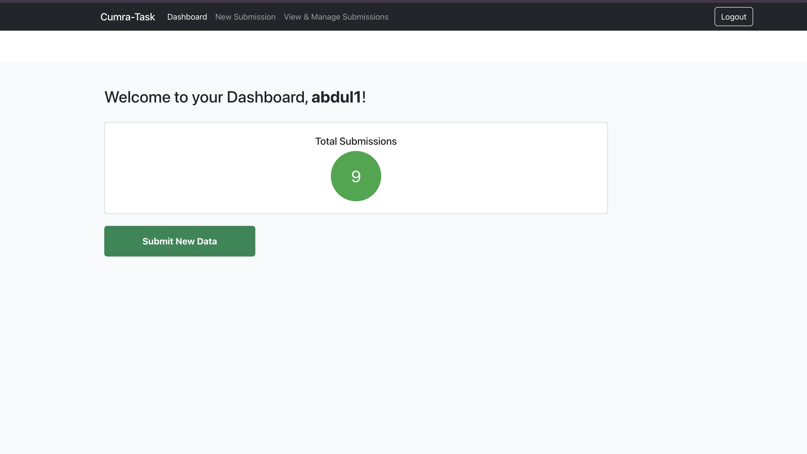
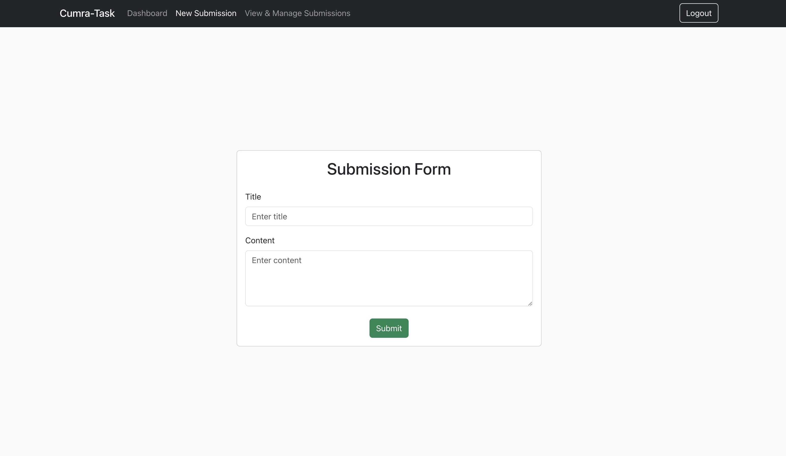
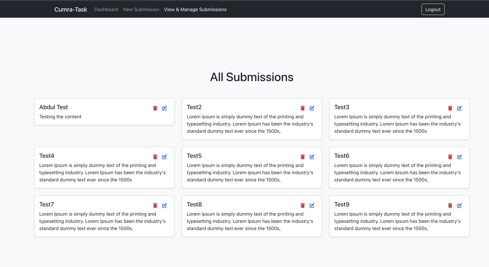
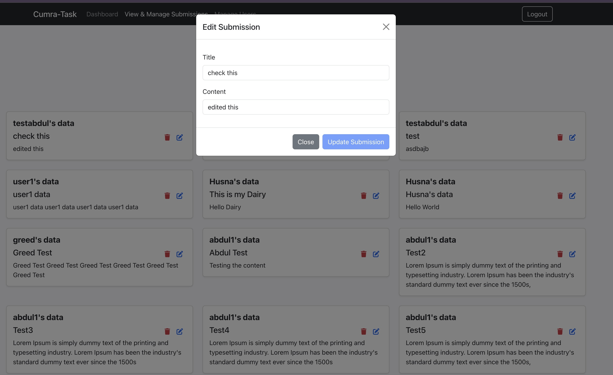
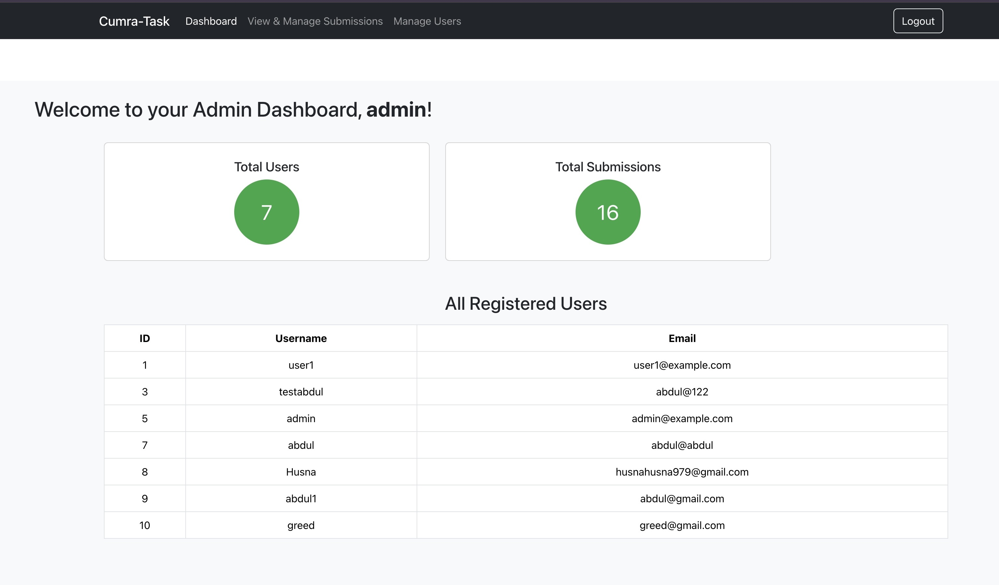
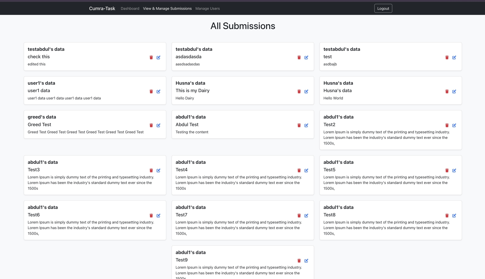
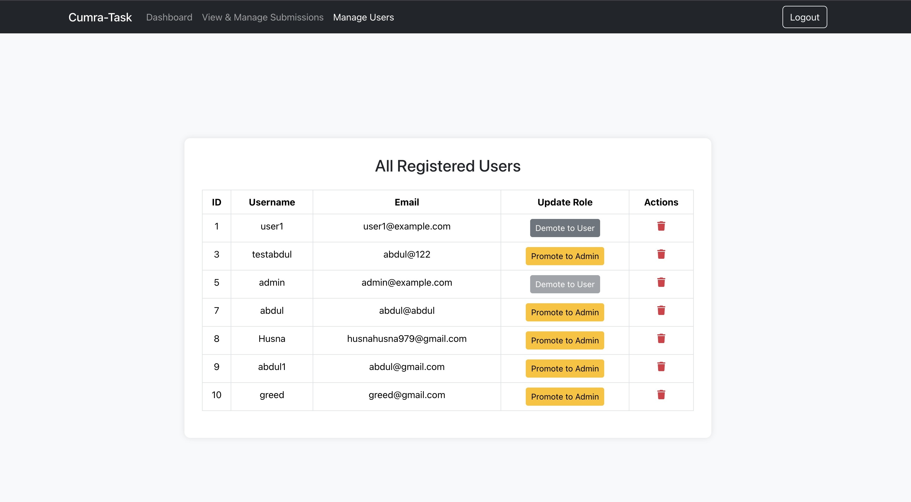

# Cumra Task App

A full-stack web application with **secure role-based authentication** built using React and Spring Boot.  
It allows:

- **Users** to register, log in, and manage their own data submissions
- **Admins** to manage users, update roles, and view all submissions

---

## Tech Stack

**Frontend**
- React JS
- Bootstrap 5
- Context API
- Axios

**Backend**
- Spring Boot
- Spring Security (JWT-based Auth)
- Hibernate + JPA
- MySQL or H2 (for dev)

---

## Setup Instructions

### Backend (Spring Boot)

1. Clone the project:
   ```bash
   git clone https://github.com/your-username/cumra-task-app.git
   cd backend
2. Configure DB & JWT in application.properties:
   
   spring.application.name=backend
   #### Database Config
   spring.datasource.url=jdbc:mysql://localhost:3306/cumrataskapp
   spring.datasource.username=root
   spring.datasource.password=yourpassword

   spring.jpa.hibernate.ddl-auto=update
   spring.jpa.show-sql=true
   spring.jpa.properties.hibernate.dialect=org.hibernate.dialect.MySQLDialect

   #### Server Port
   server.port=8080

   #### JWT Secret (Placeholder)
   app.jwtSecret = CumraSecureJWTKey_AdminUserDataFlow123456!
   app.jwtExpirationsMs = 86400000

   #### CORS
   spring.web.cors.allowed-origins=http://localhost:5173

4. Run the backend:
   ./mvnw spring-boot:run

### Frontend (React)

1. Navigate to the frontend directory:
   cd frontend

2. Install dependencies:
   npm install

3. Create a .env file:
   VITE_API_BASE_URL=http://localhost:8080/api

4. Start the frontend:
   npm run dev

## Test Credentials

| Role  | Username   | Password   |
|-------|------------|------------|
| Admin | admin  | Abdul*1234  |
| User  | abdul1   | Abdul*1234  |

## API Overview

### Auth

1. POST /api/auth/signup – Register
2. POST /api/auth/login – Login (returns JWT)

### User Endpoints

1. GET /api/user/submissions
2. POST /api/user/submissions
3. PUT /api/user/submissions/{id}
4. DELETE /api/user/submissions/{id}

### Admin Endpoints

1. GET /api/admin/users
2. PUT /api/admin/users/roles/{id}
3. DELETE /api/admin/users/{id}
4. GET /api/admin/submissions
5. PUT /api/admin/submissions/{id}
6. DELETE /api/admin/submissions/{id}


## Screenshots

## Authentication

### Login Page


### Signup Page


## User Portal

### User Dashboard


### User New Submission Page


### User Manage Submission Page


### User Edit Submission Popup



## Admin Portal

### Admin Dashboard


### Admin Manage Submissions Page


### Admin Edit Submission Popup


### Admin Manage Users Page


## Demo Video

[Click here to watch the demo](https://youtu.be/QY6sCpnSrL0)


